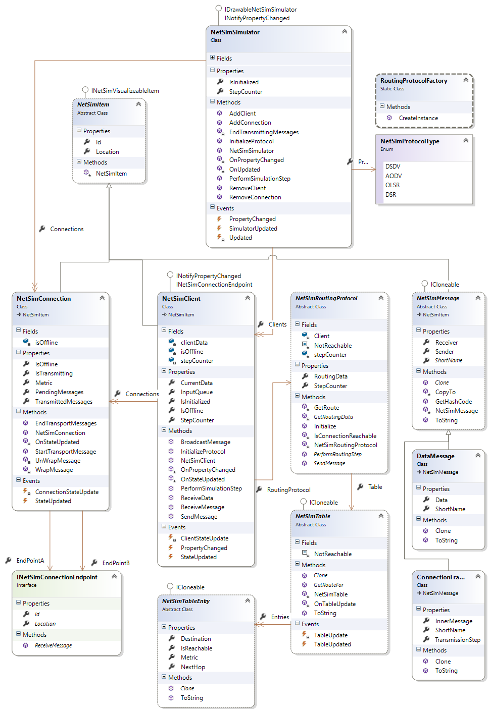

# NetSim

Ad-hoc Network Simulator - Routing Protocols Simulation of DSDV/OLSR/AODV/DSR

## Introduction
This project is created as part of the course Adaptive Systems. The goal of the project
is to simulate various dynamic routing protocols. The following chapter will explain
the problem description of the project, the investigation methods and the taken
assumtions based on the problem description.

The task for this project is as follows. Simulate various dynamic routing protocols
for a varying number of participating nodes. You must provide a visualization
of your results which demonstrates the necessary steps for handling the routing
mechanism (e.g., the creation of routing tables). You must provide realization parts
for all routing protocols. The endresult should be a prototype with test procedures
and a documentation file.

- Implementation of varying node count and edges
- Correct realization of DSDV/OLSR/AODV/DSR
- Correct handling of churns
- Visualization of the network
- Visualization of the protocol specific aspects
- Describe your idea(s) and used algorithm(s)

## Implementation

## UI

---

FHWN Project
Adaptive Systeme - Master
